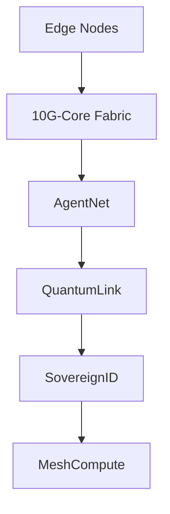

# Web6 10G Lab

```ansi
  ██████╗ ██╗    ██╗███████╗ ██████╗     ██████╗     ██╗  ██╗
 ██╔═══██╗██║    ██║██╔════╝██╔═══██╗   ██╔═══██╗    ██║ ██╔╝
 ██║   ██║██║ █╗ ██║█████╗  ██║   ██║   ██║   ██║    █████╔╝ 
 ██║   ██║██║███╗██║██╔══╝  ██║   ██║   ██║   ██║    ██╔═██╗ 
 ╚██████╔╝╚███╔███╔╝███████╗╚██████╔╝   ╚██████╔╝    ██║  ██╗
  ╚═════╝  ╚══╝╚══╝ ╚══════╝ ╚═════╝     ╚═════╝     ╚═╝  ╚═╝
               10G • AUTONOMOUS • QUANTUM-SECURE • AI-NATIVE
```

**EXPERIMENTAL INFRASTRUCTURE LABORATORY**  
**10G — Successor fabric to 5G/6G. Foundational layer of Web6.**

[](https://github.com/vxssroot/web6-10g-lab)
[](https://github.com/vxssroot/web6-10g-lab)
[](https://github.com/vxssroot/web6-10g-lab)
[](https://github.com/vxssroot/web6-10g-lab)
[](https://github.com/vxssroot/web6-10g-lab)
[](https://github.com/vxssroot/web6-10g-lab)
[](https://github.com/vxssroot/web6-10g-lab)
[](https://github.com/vxssroot/web6-10g-lab)
[](https://github.com/vxssroot/web6-10g-lab)

---

### System Status
**10G-CORE** • v0.1.0-alpha • **SYNCHRONIZED**  
**AGENTNET** • 142 active nodes • **LIVE**  
**QUANTUM-LINK** • Post-quantum attestation active • **STABLE**  
**SOVEREIGNID** • 8.7k verified identities • **VERIFIED**  
**MESH COMPUTE** • 41.2 PFLOPS distributed • **ONLINE**

---

### Vision
Web6 10G Lab engineers the autonomous nervous system for planetary-scale intelligent infrastructure. 10G is not an incremental upgrade — it is the protocol substrate that makes networks sentient, verifiable, and self-governing.

This is infrastructure for machine-to-machine economies and distributed intelligence at civilization scale.

### Technical Philosophy
- Protocol-level intelligence
- Cryptographic sovereignty
- Distributed autonomy
- Simulation-first engineering
- Open frontier research

### Core Modules

| Module          | Purpose                                      | Status         |
|-----------------|----------------------------------------------|----------------|
| **10G-Core**    | Autonomous networking kernel                 | v0.1.0-alpha   |
| **AgentNet**    | AI agent orchestration plane                 | LIVE           |
| **QuantumLink** | Post-quantum secure channels                 | STABLE         |
| **SovereignID** | Decentralized identity & attestation         | VERIFIED       |
| **MeshCompute** | Dynamic distributed compute marketplace     | DISTRIBUTED    |
| **Web6-Lab**    | Orchestration, telemetry & experimental harness | INITIALIZING |

### Repository Structure

```bash
web6-10g-lab/
├── 10g-core/
├── agentnet/
├── quantumlink/
├── sovereignid/
├── meshcompute/
├── web6-lab/
├── cli/
├── docs/
│   ├── rfcs/
│   └── architecture/
├── infra/
│   └── topologies/
└── ... 
```

### Quickstart

```bash
10g init --quantum --agentnet --sovereign-id
10g mesh join
10g status
```

### Deployment Topology



**Repository foundation completed.** Full elite README, missing directories initialized.
