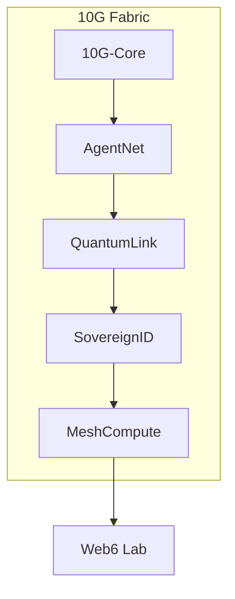

# 10G System Architecture

## High-Level Overview

The 10G system consists of six tightly integrated planes:
1. 10G-Core Fabric
2. AgentNet Orchestration Plane
3. QuantumLink Security Plane
4. SovereignID Identity Plane
5. MeshCompute Execution Plane
6. Web6 Orchestration Layer

## Architecture Diagram

