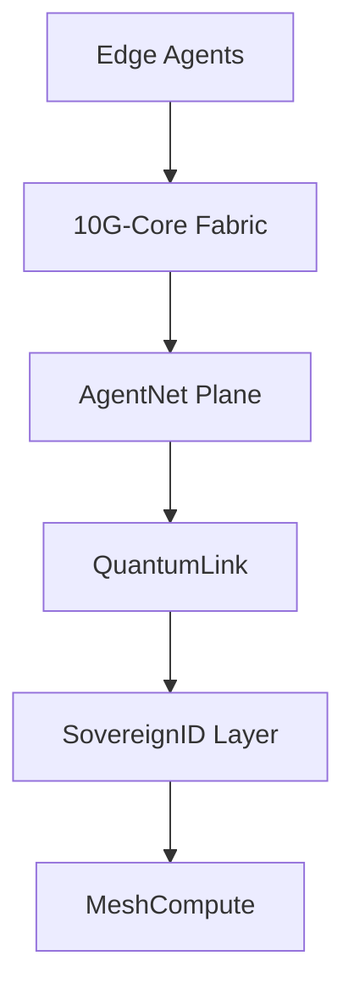

# 10G System Architecture

## High-Level Overview

```mermaid
graph TD
    A[Edge Agents] --> B[10G-Core Fabric]
    B --> C[AgentNet Plane]
    C --> D[QuantumLink]
    D --> E[SovereignID Layer]
    E --> F[MeshCompute]
```

## Components
Detailed specification of each module.