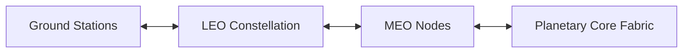

# Planetary Mesh Topology

Multi-region, multi-orbit deployment model for 10G infrastructure.

```mermaid
graph LR
    Ground[Ground Stations] <--> LEO[LEO Constellation]
    LEO <--> MEO[MEO Nodes]
    MEO <--> Core[Planetary Core Fabric]
```